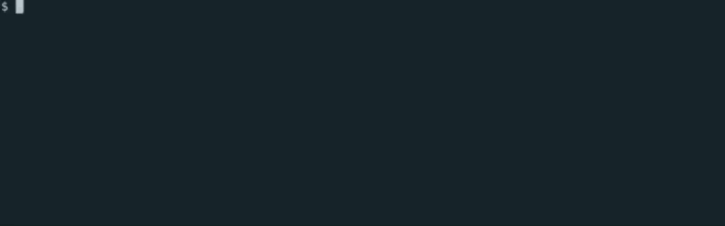
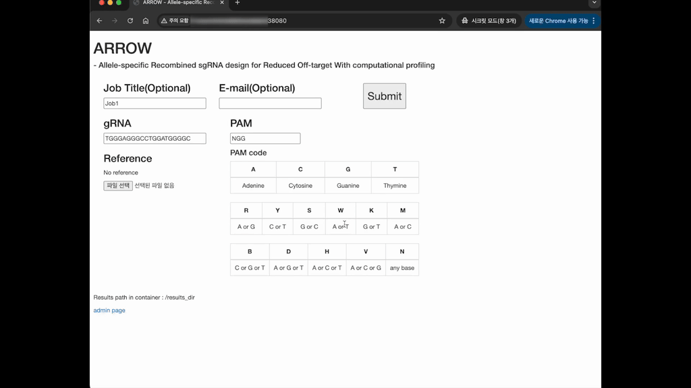

# ARROW

This web application displays the results of CAS9 mismatch analysis through a web interface. This README file provides instructions on how to install and run the application.

## Quick Start

This application runs within Docker containers. Ensure you have Docker installed before proceeding.



1.  **Run the Application:** Navigate to the directory containing the `docker-compose.yml` file and execute the following command:

    ```bash
    docker compose up -d
    # If you do not have an Nvidia GPU, you must run it using the CPU version command below.
    # docker compose -f docker-compose.cpu.yml up -d
    ```

2.  **Access the Application:** Once the containers are running, open your web browser and go to `http://localhost:38080`.

That's it! You should now be able to use the application.

**Note:** This Quick Start uses the default configuration, which is optimized for GPU environments.

## Usage

### Uploading FASTA Files


[YouTube link](https://youtu.be/atT8QwlEyxc)

### Managing Jobs


[YouTube link](https://youtu.be/i0csDLiqVOQ)

## Docker Compose Configuration Details

The `docker-compose.yml` file defines how the application is run within Docker. Here's a breakdown of the key options:

- **`runtime: nvidia`:** This option enables the use of an NVIDIA GPU for accelerated processing. If you don't have an NVIDIA GPU, you should use the CPU version.
- **`volumes:`**
  - **`- ./gen-ref:/gen_ref`:** This mounts the `gen-ref` directory on your computer to the `/gen_ref` directory inside the container. This is where the application expects to find reference files needed for the analysis. You should place your reference files in the `./gen-ref` directory.
- **`environment:`** These are environment variables that configure the application within the container:
  - **`REF_DIR=/gen_ref`:** This variable tells the application where to find the reference files inside the container (which is `/gen_ref`).
  - **`RESULTS_DIR=/results_dir`:** This variable specifies where the application should store the results of the analysis inside the container.
  - **`GMAIL_ID=False` and `GMAIL_PW=False`:** These variables are used for email notifications. Setting them to `False` disables email notifications. If you want to enable email notifications, you should replace `False` with your Gmail ID and password. **(Do not change it,does not work.)**
  - **`DJANGO_SUPERUSER_EMAIL=xxx@email.com`:** This sets the email address for the Django superuser account. You should change `xxx@email.com` to your email address. **(Do not change it,does not work.)**
  - **`DJANGO_SUPERUSER_USERNAME=admin`:** This sets the username for the Django superuser account.
  - **`DJANGO_SUPERUSER_PASSWORD=Arrow`:** This sets the password for the Django superuser account. You should change this to a more secure password.
  - **`TIME_ZONE=UTC`:** This sets the timezone inside the container to Coordinated Universal Time (UTC).
  - **`NVIDIA_VISIBLE_DEVICES=0`:** This specifies that the application should use the first available NVIDIA GPU (device `0`).
  - **`NVIDIA_DRIVER_CAPABILITIES=compute,utility`:** This option specifies the capabilities of the NVIDIA driver that the container needs.
- **`ports:`**
  - **`- 38080:8080`:** This maps port `38080` on your computer to port `8080` inside the container. This is how you access the web application in your browser at `http://localhost:38080`.

## Installation and Execution

This application can be easily installed and run using Docker. Follow the steps below to get started.

### 1. Install Docker

To run the application, you must first have Docker installed. If you don't have Docker installed, download and install Docker Desktop for your operating system from the following link:

- [Download Docker](https://www.docker.com/)

### 2. Download the Application

Download the source code for running the application. You can clone the GitHub repository using the following command:

```bash
git clone https://github.com/dwchoo/ARROW.git
cd CAS9-mismatch-webapp
```

### 3. Build the Docker Image

Build the Docker image required to run the application. Execute the following command in the directory containing the `docker-compose.yml` file:

```bash
docker compose build
```

This command will build a new image based on the `ghcr.io/dwchoo/arrow:latest` image, as defined in the `docker-compose.yml` file. The build process may take some time depending on your internet connection.

### 4. Run the Application

Once the Docker image has been built successfully, you can run the application using the following command:

```bash
docker compose up -d
```

The `-d` option runs the application in detached mode (in the background).

### 5. Access the Application

If the application runs successfully, you can access it by opening your web browser and navigating to the following address: `http://localhost:38080`

### 6. Stop the Application

To stop the application, execute the following command in the directory containing the `docker-compose.yml` file:

```bash
docker compose down
# CPU version
# docker compose -f docker-compose-cpu.yml down
```

This command will stop and remove the running containers.
